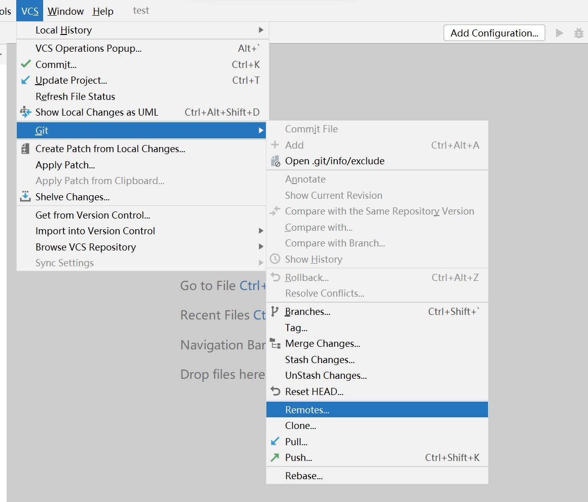
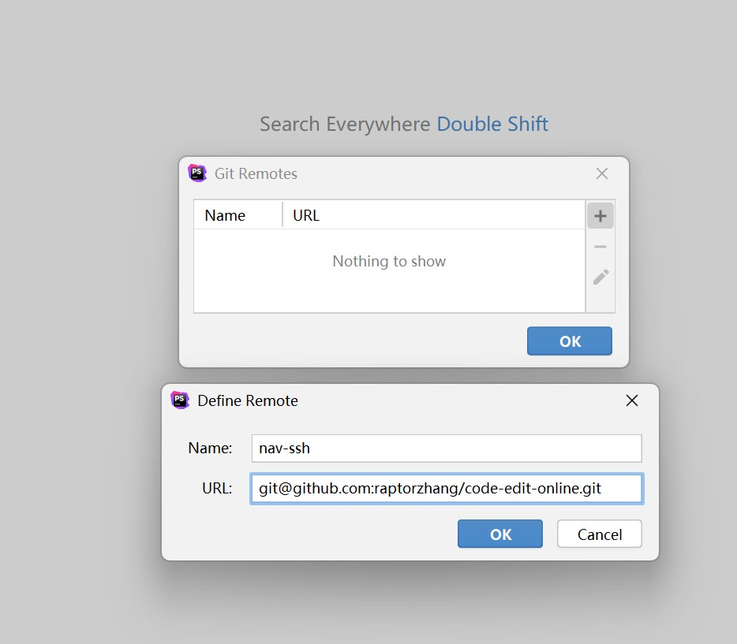
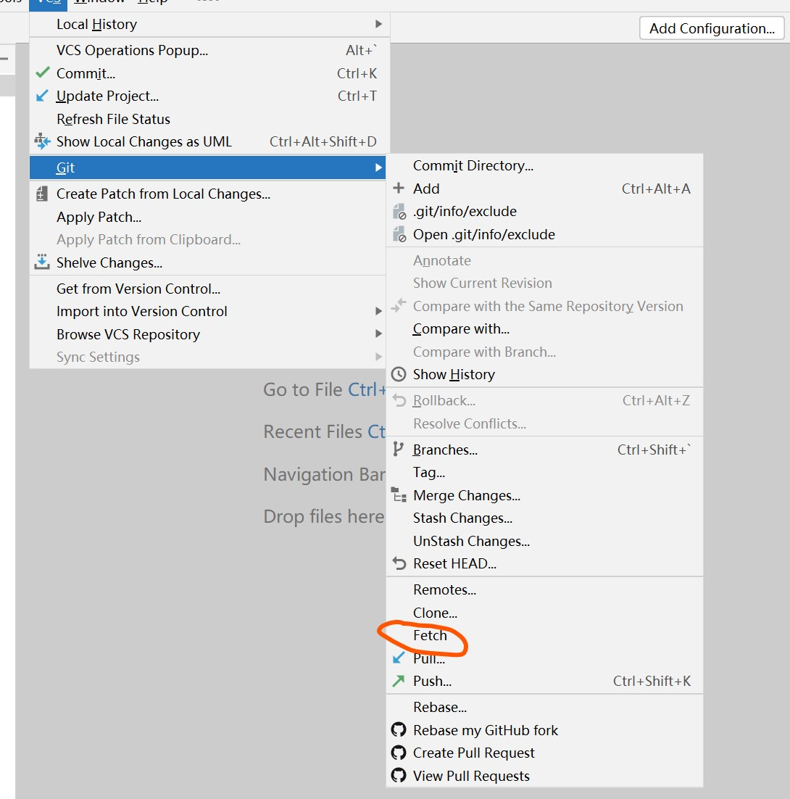
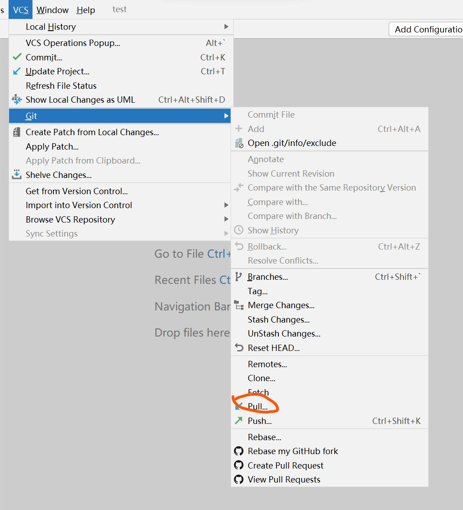
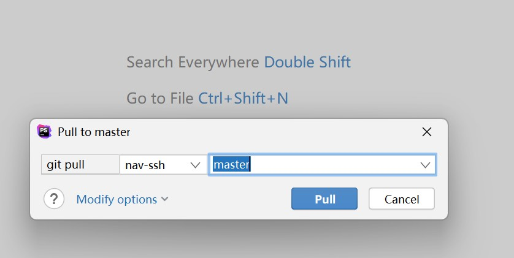
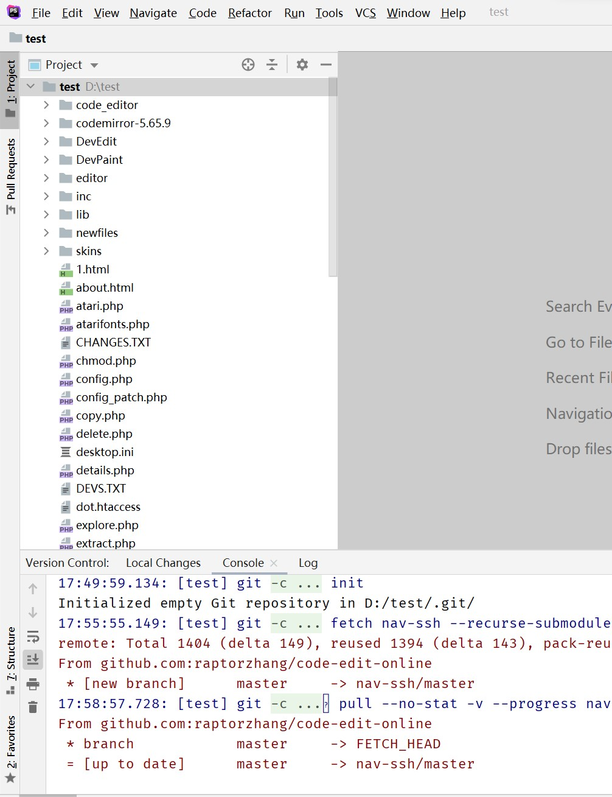

#git的IDE设置与操作

###设置忽略列表
    xxx.ignore 名字并不重要，后缀一定，目录也不限，但是最好是home目录；我通常放在程序根目录；
    然后在user/.gitconfig里面的内容如下
```    
[user]
	name = raptorzhang
	email = raptorzhang@gmail.com
[safe]
	directory = D:/navfile
	directory = F:/gitcolontest/code-edit-online
[core]
	excludesfile = D:/navfile/.gitignore
```

配置主要是选中对应exe,以jetbrain家的为例；setting > version control > git 添加exe
VCS > Import Verion Control > Crearte  Git Repository;
然后程序目录就会生成 .git配置目录；

###拉取远程代码
    
    新建项目，打开如图

   
    添加一个远端的地址


    把code里面的ssh填写，注意http会很卡

    
    fetch一下，可以更新上面的远端节点

    
    选择pull
   

    选择要pull的远程分支
 
    
    现在你的master上面就已经部署了远程端点的代码了
 

### 如果出现 refusing to merge unrelated histories
    如果是这样的话就意味着，之前两个独立分支没有交集，需要用代码强制发生交集一下

```
$ git pull github-erp-ssh master --allow-unrelated-histories
From github.com:raptorzhang/erp
 * branch            master     -> FETCH_HEAD
Merge made by the 'ort' strategy.

```